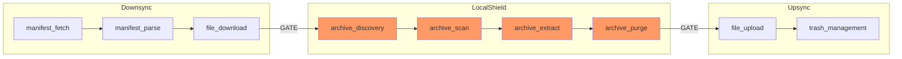

# SyncPortal Smart Control Matrix - Complete Analysis

## Overview

This document analyzes ALL portal operations across all three panels (Downsync, Local Shield, Upsync) and defines the dependency gates for start/pause/stop controls at both per-panel and global levels.

---

## Panel Operations Inventory

### Panel 1: Downsync

| Operation | Description | Subprocess | Can Abort Mid-Op |
|-----------|-------------|------------|------------------|
| **manifest_fetch** | Download manifest.txt from source or backup | rclone | ✅ Yes |
| **manifest_parse** | Compare remote vs local, generate missing.txt | sync (CPU) | ✅ Yes (fast) |
| **file_download** | Pull missing files from source | rclone | ✅ Yes |

### Panel 2: Local Shield (Malware Protection)

| Operation | Description | Subprocess | Can Abort Mid-Op |
|-----------|-------------|------------|------------------|
| **archive_discovery** | Find all .zip/.7z/.rar in local_dir | glob | ✅ Yes |
| **archive_scan** | Peek inside archive for patterns | 7z/rar (spawnSync) | ⚠️ Between archives |
| **archive_extract** | Extract safe files from flagged archive | 7z/rar (spawnSync) | ⚠️ Between archives |
| **archive_purge** | Delete flagged archive | fs.unlink | ✅ Yes |
| **exclusion_update** | Add to exclusion list | fs.append | ✅ Yes |

### Panel 3: Upsync

| Operation | Description | Subprocess | Can Abort Mid-Op |
|-----------|-------------|------------|------------------|
| **file_upload** | Sync local files to backup provider | rclone | ✅ Yes |
| **trash_management** | Handle deleted files (trash vs permanent) | rclone | ✅ Yes |

---

## Dependency Analysis

### Sequential Pipeline Dependencies



### Gate Definitions

| Gate ID | From | To | Type | Condition |
|---------|------|-----|------|-----------|
| **G1** | Downsync | LocalShield | Soft | Downsync complete OR no source configured |
| **G2** | LocalShield | Upsync | **HARD** | Shield complete AND no unscanned files |
| **G3** | GDrive Config | Shield Disable | **LOCKOUT** | Cannot disable shield when backup=gdrive |

---

## Per-Panel Control Behaviors

### Downsync Panel

| Action | State Transition | Effect on Other Panels | Persist |
|--------|-----------------|------------------------|---------|
| **START** | idle → running | None | - |
| **PAUSE** | running → paused | None (others already waiting) | ✅ Save progress |
| **RESUME** | paused → running | None | ✅ Load progress |
| **STOP** | any → stopped | Warn: "Files downloaded but unscanned" | ✅ Mark incomplete |

**Pause Implementation:**
- Kill rclone process gracefully
- Record last successful file index
- On resume, use `--files-from` with remaining files

### Local Shield Panel

| Action | State Transition | Effect on Other Panels | Persist |
|--------|-----------------|------------------------|---------|
| **START** | idle → running | Block Upsync | - |
| **PAUSE** | running → paused | Keep Upsync blocked | ✅ Save archive index |
| **RESUME** | paused → running | Continue blocking Upsync | ✅ Load archive index |
| **STOP** | any → incomplete | ⛔ HARD BLOCK Upsync | ✅ Mark incomplete |

**Pause Implementation:**
- Set `pauseRequested` flag
- Complete current archive scan
- Pause before next archive
- Record: `{lastScannedArchive, scannedList, unscannedList}`

**Critical Rule:** Upsync CANNOT proceed if:
- Shield is enabled AND
- Shield status is NOT "complete"

### Upsync Panel

| Action | State Transition | Effect on Other Panels | Persist |
|--------|-----------------|------------------------|---------|
| **START** | idle → running | None | Requires G2 clear |
| **PAUSE** | running → paused | None | ✅ Save upload progress |
| **RESUME** | paused → running | None | ✅ Load upload progress |
| **STOP** | any → incomplete | None | ✅ Mark incomplete |

**Gate Check on START:**
```typescript
function canStartUpsync(): { allowed: boolean; reason?: string } {
    if (!config.upsync_enabled) 
        return { allowed: false, reason: "Upsync not enabled" };
    
    if (config.backup_provider === "none")
        return { allowed: false, reason: "No backup provider configured" };
    
    if (config.enable_malware_shield) {
        if (syncState.shieldStatus !== "complete")
            return { allowed: false, reason: "Malware shield has not completed. Unscanned files cannot be uploaded." };
    }
    
    return { allowed: true };
}
```

---

## Global Control Behaviors

| Action | Behavior |
|--------|----------|
| **START ALL** | Start Downsync → Auto-advance to Shield → Auto-advance to Upsync |
| **PAUSE ALL** | Pause current phase, others remain in their state |
| **RESUME ALL** | Resume from paused phase, continue pipeline |
| **STOP ALL** | Stop all phases, mark incomplete states |

### Global Pause Logic

```typescript
function globalPause(): void {
    if (syncState.downsync === "running") pauseDownsync();
    else if (syncState.shield === "running") pauseShield();
    else if (syncState.upsync === "running") pauseUpsync();
}
```

### Global Resume Logic

```typescript
function globalResume(): void {
    // Resume from where we left off
    if (syncState.downsync === "paused") resumeDownsync();
    else if (syncState.downsync === "complete" && syncState.shield === "paused") resumeShield();
    else if (syncState.shield === "complete" && syncState.upsync === "paused") resumeUpsync();
    // If nothing is paused but pipeline isn't done, start next phase
    else if (syncState.downsync === "complete" && syncState.shield === "idle") startShield();
    else if (syncState.shield === "complete" && syncState.upsync === "idle") startUpsync();
}
```

---

## Malware Shield Lock Rules

### Provider-Based Shield Lock

| Backup Provider | Shield Mandatory | Reason |
|-----------------|------------------|--------|
| **gdrive** | ✅ LOCKED | Google suspends projects for malware |
| dropbox | ⚠️ Recommended | May be added to mandatory |
| onedrive | ⚠️ Recommended | May be added to mandatory |
| b2 | Optional | B2 doesn't scan content |
| r2 | Optional | Cloudflare R2 doesn't scan |
| sftp | Optional | Your own server |
| pcloud | ⚠️ Recommended | May be added to mandatory |
| mega | ⚠️ Recommended | May be added to mandatory |
| none | N/A | No upsync |

### Shield Lock Implementation

```typescript
function isShieldMandatory(config: PortalConfig): boolean {
    const mandatoryProviders = ["gdrive"]; // Expand as needed
    return config.upsync_enabled && mandatoryProviders.includes(config.backup_provider);
}

function canDisableShield(config: PortalConfig): { allowed: boolean; reason?: string } {
    if (isShieldMandatory(config)) {
        return { 
            allowed: false, 
            reason: `Malware Shield cannot be disabled when using ${config.backup_provider.toUpperCase()} as backup. This provider flags malicious content and may suspend your account.`
        };
    }
    return { allowed: true };
}
```

---

## State Persistence Schema

```typescript
interface SyncSessionState {
    sessionId: string;
    startedAt: number;       // Unix timestamp
    lastUpdatedAt: number;
    
    // Phase statuses
    downsyncStatus: "idle" | "running" | "paused" | "complete" | "incomplete" | "error";
    shieldStatus: "idle" | "running" | "paused" | "complete" | "incomplete" | "error";
    upsyncStatus: "idle" | "running" | "paused" | "complete" | "incomplete" | "error";
    
    // Downsync tracking
    downloadedFiles: string[];
    totalFilesToDownload: number;
    lastDownloadedIndex: number;
    
    // Shield tracking
    scannedArchives: string[];
    unscannedArchives: string[];
    totalArchives: number;
    flaggedArchives: string[];
    
    // Upsync tracking
    uploadedFiles: string[];
    totalFilesToUpload: number;
    lastUploadedIndex: number;
    
    // Error tracking
    errors: Array<{ phase: string; message: string; timestamp: number }>;
}
```

### Persistence Path

```
config.local_dir/.sync_state.json
```

### Recovery on App Start

```typescript
async function checkPreviousSession(): SyncSessionState | null {
    const statePath = join(config.local_dir, ".sync_state.json");
    if (existsSync(statePath)) {
        const state = JSON.parse(readFileSync(statePath, "utf-8"));
        
        // Check if session is incomplete
        if (state.downsyncStatus === "incomplete" || 
            state.shieldStatus === "incomplete" || 
            state.upsyncStatus === "incomplete") {
            return state;
        }
    }
    return null;
}
```

---

## UI Control Mapping

### Per-Panel Controls

| Panel | Start Button | Pause Button | Stop Button | Status Indicator |
|-------|--------------|--------------|-------------|------------------|
| **Downsync** | ✅ Always allowed | ✅ When running | ⚠️ Warns about unscanned | `[Running] [Paused] [Complete] [Incomplete]` |
| **Shield** | ⏳ Auto or Manual | ✅ Between archives | ⛔ Blocks Upsync | `[Scanning] [Paused] [Complete] [Incomplete] [LOCKED]` |
| **Upsync** | ⛔ Gate-checked | ✅ When running | ✅ Safe | `[Running] [Paused] [Complete] [Incomplete] [BLOCKED]` |

### Global Controls

| Key | Action | Condition |
|-----|--------|-----------|
| `Enter` | Start/Resume | When any phase is idle/paused |
| `Space` | Pause | When any phase is running |
| `Esc` | Stop All | Always (with confirmation if Shield running) |

### Hotkey Detail

| Key | Context | Action |
|-----|---------|--------|
| `1` | SyncPortal | Focus Downsync panel |
| `2` | SyncPortal | Focus Shield panel |
| `3` | SyncPortal | Focus Upsync panel |
| `p` | Focused panel | Pause this panel |
| `r` | Focused panel | Resume this panel |
| `s` | Focused panel | Stop this panel (with gate checks) |
| `Enter` | Global | Start/Resume pipeline |
| `Space` | Global | Pause current phase |
| `Esc` | Global | Stop all (with confirmation) |

---

## Warning Messages

| Scenario | Message |
|----------|---------|
| Stop during Downsync | "⚠️ Downloaded files have not been scanned. Run Malware Shield before backing up." |
| Stop during Shield | "⛔ Malware scan incomplete. Cloud backup is BLOCKED until scan completes." |
| Try to start Upsync with incomplete Shield | "⛔ Cannot upload: Malware Shield has not verified all files." |
| Try to disable Shield with GDrive | "🔒 Malware Shield is LOCKED. Google Drive suspends accounts for malicious content." |
| Incomplete session detected on start | "⚠️ Previous sync was interrupted. Resume from where you left off?" |

---

## Full Gate Decision Matrix

This matrix shows what happens for every combination of operation and state:

| Current State | Downsync START | Downsync PAUSE | Downsync STOP | Shield START | Shield PAUSE | Shield STOP | Upsync START | Upsync PAUSE | Upsync STOP |
|---------------|----------------|----------------|---------------|--------------|--------------|-------------|--------------|--------------|-------------|
| **All Idle** | ✅ | - | - | ⏳ Wait for DS | - | - | ⛔ Wait for Shield | - | - |
| **DS Running** | - | ✅ | ✅ (warn) | ⏳ Wait | - | - | ⛔ Wait | - | - |
| **DS Paused** | - | - | ✅ (warn) | ⏳ Wait | - | - | ⛔ Wait | - | - |
| **DS Complete, Shield Idle** | - | - | - | ✅ | - | - | ⛔ Wait for Shield | - | - |
| **Shield Running** | - | - | - | - | ✅ | ⛔ Blocks US | ⛔ Wait | - | - |
| **Shield Paused** | - | - | - | - | - | ⛔ Blocks US | ⛔ Blocked | - | - |
| **Shield Incomplete** | ✅ (re-download?) | - | - | ✅ Resume | - | - | ⛔ BLOCKED | - | - |
| **Shield Complete, US Idle** | - | - | - | - | - | - | ✅ | - | - |
| **US Running** | - | - | - | - | - | - | - | ✅ | ✅ |
| **US Paused** | - | - | - | - | - | - | - | - | ✅ |
| **US Incomplete** | - | - | - | - | - | - | ✅ Resume | - | - |
| **All Complete** | ✅ (new session) | - | - | ✅ (re-scan) | - | - | ✅ (re-upload) | - | - |

Legend:
- ✅ = Allowed
- ⛔ = Blocked (hard gate)
- ⏳ = Waiting (auto-starts when dependency clears)
- ⚠️ = Allowed with warning
- `-` = Not applicable in this state

---

## Summary

### Key Rules

1. **No automatic resume** - User must explicitly return to Portal and click Resume
2. **Shield is gate-keeper** - Upsync CANNOT proceed if Shield incomplete
3. **GDrive = Shield LOCKED** - Cannot disable malware protection with GDrive backup
4. **Per-panel + Global controls** - Fine control with logical constraints
5. **Persist all state** - Crash recovery via `.sync_state.json`
6. **Warnings, not silent blocks** - Always tell user WHY something is blocked

### Implementation Priority

1. State persistence layer (`.sync_state.json`)
2. AbortSignal for cleanup.ts (pause between archives)
3. Gate checks in useSync hook
4. Per-panel control UI
5. Global control hotkeys
6. Shield lock for GDrive
