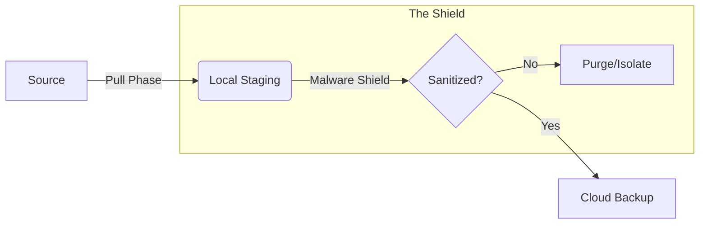

# 🦅 Schematic Sync Portal

> **The Zero-Terminal, Multi-Cloud Solution for Secure Schematic Management.**

The **Schematic Sync Portal** is a high-security TUI (Terminal User Interface) application designed to bridge local schematic archives with the cloud without compromising system integrity.

---

## 🏛️ The Portal Pillars

| 🛡️ Surgical Isolation | ⚡ Zero-Terminal Setup | 🧼 Malware Shield |
| :--- | :--- | :--- |
| Dedicated Rclone remotes that never touch your global system configuration. | Complete OAuth handshake within the TUI—no manual config editing required. | Pipelined scanning that purges or isolates threats before backup. |

---

## 🚀 Features

### ☁️ Multi-Cloud Sovereign Containers
Support for **8+ Cloud Providers** in isolated environments:
*   **Google Drive** (Project-Isolated w/ Guided Setup)
*   **Backblaze B2** ($6/TB Pro Storage)
*   **Cloudflare R2** (Zero Egress Fees)
*   **SFTP / Private Server** & **pCloud**
*   **OneDrive**, **Dropbox**, and **Mega.nz**

### 🛡️ Security First
*   **Config Sandboxing**: Uses private `rclone.conf` paths to prevent credential leakage.
*   **Rclone CLI Engine**: Leverages industry-standard binaries for robust transfer management.
*   **Multi-Stage Policy**: Granular control over questionable files (Purge vs. Isolate).

### 🖥️ Native Experience
*   **Modern TUI**: A beautiful, mouse-supported terminal interface built with Ink.
*   **Integration**: Auto-creates `.desktop` entries and Start Menu shortcuts.

---

## 📦 Installation & Usage

**Prerequisites:** `bun` (Runtime) and `rclone` (Backend).

```bash
# 1. Install Dependencies
bun install

# 2. Run the Portal
bun dev
```

The First-Run Wizard will guide you through system integration, source configuration, and provider authentication.

---

## 📐 Architecture

The portal uses a **Three-Phase Sync Engine** optimized for parallel processing.



*   **Frontend**: React TUI ([OpenTUI](https://github.com/opentui))
*   **Backend**: Bun + Rclone CLI Wrapper
*   **State**: `~/.config/schem-sync-portal/config.json`

---

## 🔧 Troubleshooting

### Common Setup Issues
*   **Browser Auth Fails**: Ensure your default browser is accessible. Rclone opens a local port for the OAuth callback.
*   **API Rate Limits**: Large schematic dumps can hit GDrive/OneDrive rate limits. The Portal automatically handles retries with exponential backoff.
*   **Missing Icons**: Ensure you are using a **Nerd Font** in your terminal for the best visual experience.

### ⚠️ Safe Mode (Reset)
If you need to reset the Portal's configuration:
1.  Launch the app and hold `ESC` on the dashboard.
2.  Select **Portal Only** reset to clear configuration without affecting other system backups.

---
*Built for the Repair community, keep Right to Repair alive and thriving. 🦅*
