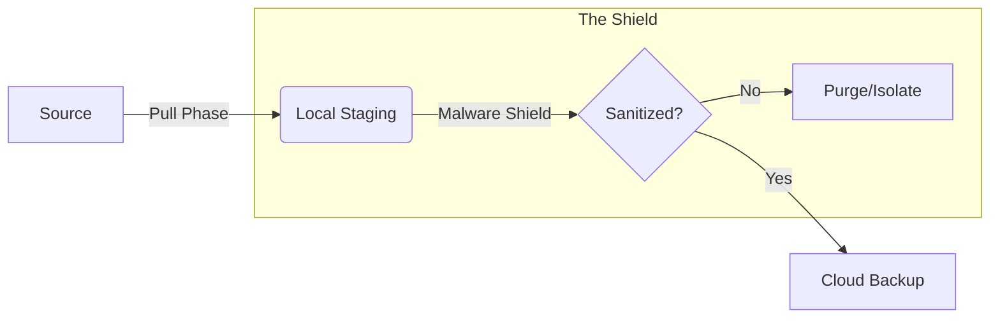

# 🦅 Schematic Sync Portal

> **The Zero-Terminal, Multi-Cloud Solution for Secure Schematic Management.**

The **Schematic Sync Portal** is a high-security TUI (Terminal User Interface) application designed to bridge local schematic archives with the cloud without compromising system integrity.

---

## 🏛️ The Portal Pillars

| 🛡️ Surgical Isolation | ⚡ Zero-Terminal Setup | 🧼 Malware Shield |
| :--- | :--- | :--- |
| Dedicated Rclone remotes that never touch your global system configuration. | Complete OAuth handshake within the TUI—no manual config editing required. | Pipelined scanning that purges or isolates threats before backup. |

---

## 🌎 Supported Platforms

| Linux 🐧 | Windows 🪟 | macOS 🍎 |
| :--- | :--- | :--- |
| XDG compliant. Standard `.desktop` integration. | `APPDATA` based config. Start Menu shortcuts. | `Application Support` storage. `.command` launcher. |

---

## 🛠️ Technical Dependencies

### System Requirements
*   **Runtime**: [Bun](https://bun.sh) (v1.0+) — Fast JavaScript runtime & package manager.
*   **Backend**: [Rclone](https://rclone.org) — The "Swiss army knife" of cloud storage. Must be in your system `PATH`.
*   **Extraction & Shielding**: `7z`, `7za`, or `unzip` — **Critical Core Dependency**. Used by the Malware Shield to surgically sanitize archives and by the Font Installer.
*   **Visuals**: A terminal with **Nerd Font** support (e.g., JetBrainsMono, FiraCode) is required for icon rendering.

### Desktop Integration
*   The Portal can automatically create system shortcuts (`.desktop`, `.bat`, or `.command`) for one-click access.

---

## � Installation & Setup

### 1. Quick Start (Development)
```bash
# Clone the repository
git clone https://github.com/RepairYourTech/schem-sync-portal.git
cd schem-sync-portal

# Install dependencies
bun install

# Run the portal
bun dev
```

### 2. First-Run Wizard
Upon first launch, the Portal will guide you through:
1.  **System Integration**: Creating a desktop/launcher shortcut.
2.  **Visual Audit**: Verifying Nerd Font support (and offering auto-install if missing).
3.  **Source Config**: Connecting to your schematic source (HTTP/WebDAV).
4.  **Cloud Selection**: Authenticating with your preferred provider (8+ supported).

---

## 🛡️ Features & Security

### ☁️ Sovereign Cloud Containers
The Portal is specifically optimized for **Slime's CopyParty server** (Primary Source). All other source options are currently considered **BETA**.

Support for **8+ Cloud Providers** in isolated environments:
*   **GDrive**, **Backblaze B2**, **Cloudflare R2**, **pCloud**, **OneDrive**, **Dropbox**, **Mega.nz**, and **SFTP**.

> [!CAUTION]
> **GOOGLE DRIVE SECURITY WARNING**: Backing up schematics to Google Drive **REQUIRES** the Malware Shield to be enabled. Failure to sanitize archives *will* result in your Google Cloud Console project being suspended due to TOS violations (hosting/transferring detected "malware" archives).

### 🛡️ Malware Shield Policy
*   **Surgical Purge**: Automatically removes high-risk files (e.g., executables inside schematic archives).
*   **Isolation**: Moves questionable files to a dedicated `_risk_tools` folder instead of deleting them.

---

## 📐 Architecture

The portal uses a **Three-Phase Sync Engine** optimized for parallel processing.



---

## 🔧 Troubleshooting

*   **Browser Auth Fails**: Ensure your default browser is accessible; Rclone requires it for the OAuth callback.
*   **Missing Icons**: Enable a Nerd Font in your terminal settings. If not installed, use the Portal's built-in font installer.
*   **Safe Mode (Reset)**: Launch the app and hold `ESC` on the dashboard to access the **Portal Only** reset menu.

---
*Built for the Repair community, keep Right to Repair alive and thriving. 🦅*
