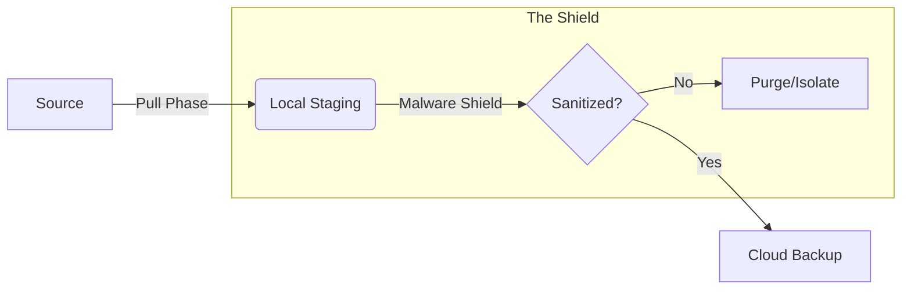

# 📜 Schematic Sync Portal - ****BETA****
> **Surgical Schematic Sync for the Repair Community**


The **Schematic Sync Portal** is a TUI (Terminal User Interface) application designed to update local schematic archives from a cloud source and optionaly create redundant cloud backups.

---

## 🏛️ The Portal Pillars

| 🛡️ Surgical Isolation | 🖥️ Zero-Terminal Setup | 🧹 Multiple Cleaning Options |
| :--- | :--- | :--- |
| Dedicated Rclone remotes that never touch your global system configuration. | Complete OAuth handshake within the TUI—no manual config editing required. | Pipelined scanning that purges or isolates threats before backup. |

---

## 🌎 Supported Platforms

| Linux 🐧 | Windows 🪟 | macOS 🍎 |
| :--- | :--- | :--- |
| XDG compliant. Standard `.desktop` integration. | `APPDATA` based config. Start Menu shortcuts. | `Application Support` storage. `.command` launcher. |

---

## 🛠️ Technical Dependencies

### System Requirements
*   **Runtime**: [Bun](https://bun.sh) (v1.0+) — Fast JavaScript runtime & package manager.
*   **Backend**: [Rclone](https://rclone.org) — The "Swiss army knife" of cloud storage. Must be in your system `PATH`.
*   **Extraction & Shielding**: `7z`, `7za`, or `unzip` — **Critical Core Dependency**. Used by the Malware Shield to surgically sanitize archives and by the Font Installer.
*   **Visuals**: A terminal with **Nerd Font** support (e.g., JetBrainsMono, FiraCode) is required for icon rendering.

### Desktop Integration
*   The Portal can automatically create system shortcuts (`.desktop`, `.bat`, or `.command`) for one-click access.

---

## 📥 Installation & Setup

### 1. Quick Start (Development)
```bash
# Clone the repository
git clone https://github.com/RepairYourTech/schem-sync-portal.git
cd schem-sync-portal

# Install dependencies
bun install

# Run the portal
bun dev
```

### 2. First-Run Wizard
Upon first launch, the Portal will guide you through:
1.  **System Integration**: Creating a desktop/launcher shortcut.
2.  **Source Config**: Connecting to your schematic source (HTTP/WebDAV).
3.  **Cloud Selection**: Authenticating with your preferred provider (8+ supported).
4.  **Local Shield**: Choose to isolate or purge files know to flag cloud malware scanners.

---

## 🛡️ Features & Security

### ☁️ Sovereign Cloud Containers
The Portal is specifically optimized for CopyParty-based schematic repositories. All other source options are currently supported.

Support for **8+ Cloud Providers** in isolated environments:
*   **GDrive**, **Backblaze B2**, **Cloudflare R2**, **pCloud**, **OneDrive**, **Dropbox**, **Mega.nz**, and **SFTP**.

> [!CAUTION]
> **GOOGLE DRIVE SECURITY WARNING**: Backing up schematics to Google Drive **REQUIRES** the Malware Shield to be enabled. Failure to sanitize archives *will* result in your Google Cloud Console project being suspended due to TOS violations (hosting/transferring detected "malware" archives).

### 🛡️ Malware Shield (Hardened)

The Malware Shield provides a three-layered defense against malicious files:

*   **Fail-Safe Archive Validation**: Automatically flags archives that cannot be reliably listed as suspicious.
*   **Recursive Nested Scanning**: Automatically detects and scans nested archives (`.zip`, `.7z`, `.rar`) inside risky parent archives.
*   **Standalone File Scanning**: A dedicated phase that scans all pre-existing files in the local directory for malware patterns.

---

## 📐 Synchronicity: Modes & Policies

To balance security and archival completeness, the Portal offers granular control over how files are processed.

### 🔄 Sync Modes: Lean vs Full
*   **Lean Mode (Surgical)**: **[Recommended]** Specifically designed for schematic collectors. It uses strict path-pattern matching to purge non-schematic files (like `.BIN`, `.EXE`, `.MSI` or Large BIOS dumps) while preserving repair artifacts (`.PDF`, `.BRD`, `.TVW`). This minimizes cloud storage bloat and maximizes security.
*   **Full Mode (Archival)**: Allows all files to pass through to the local archive. Local Shield can be used to purge or isolate known flagged files or to ignore them. Best for users who require total mirror parity.

### 🛡️ Shield Policies: Purge vs Isolate
*   **Purge (Maximum Safety)**: Matches that violate security rules or Lean boundaries are **permanently deleted** from the local environment before they can reach the cloud.
*   **Isolate (Audit Mode)**: Matches are moved to a quarantined `_risk_tools/` directory in your local schematics folder. This allows advanced users to manually inspect "detections" without risking cloud contamination.
*   **Both options will check archives (zip, rar) for known useful schematics etc and surgically extract them to their appropriate place in the local copy before purging or isolating the known bad files from the archives, keeping the good and not the bad. 

---

## 📐 Architecture

The portal uses a **Three-Phase Sync Engine** optimized for parallel processing.



---

## 🤖 Agent-Assisted Development

This repository includes specialized tools for contributors using AI agents (e.g., Roo-Code, Windsurf, Cursor, Claude Code, Kilo Code). 

*   **Local Skills**: Found in `.agent/skills/`, these provide agents with deep project context.
*   **Standardized Workflows**: Found in `.agent/workflows/`, these allow agents to automate complex tasks like pushing changes and creating PRs consistently.

---

## 🔧 Troubleshooting

*   **Browser Auth Fails**: Ensure your default browser is accessible; Rclone requires it for the OAuth callback.
*   **Missing Icons**: Enable a Nerd Font in your terminal settings.
*   **Safe Mode (Reset)**: If configuration is broken, go to **Options** (Hotkey `o`) and select **RESET CONFIGURATION**.

---

## 🤝 Collaboration

We welcome contributions from the repair community! 

*   **Want to help?** Read our [COLLABORATION.md](file:///home/birdman/schem-sync-portal/COLLABORATION.md) for technical standards.
*   **Found a bug?** Use our [Bug Report](https://github.com/RepairYourTech/schem-sync-portal/issues/new?template=bug_report.yml) template.

---

## ⚖️ Governance & Redistribution
*   **License**: This project uses the **BirdMan Attribution License**. 
*   **Mandatory Attribution**: You MUST credit **BirdMan**, **Slime**, and **PD (FlexBV)** in all forks.
See the [LICENSE](file:///home/birdman/schem-sync-portal/LICENSE) file for details.

---
*Built for the Repair community, keep Right to Repair alive and thriving. 📐*
