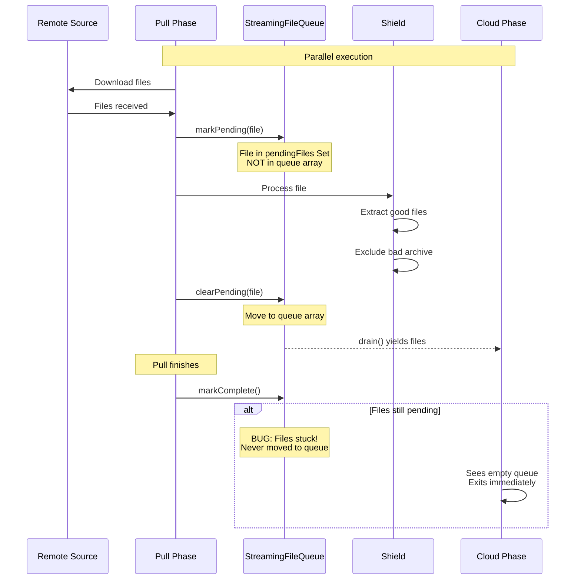
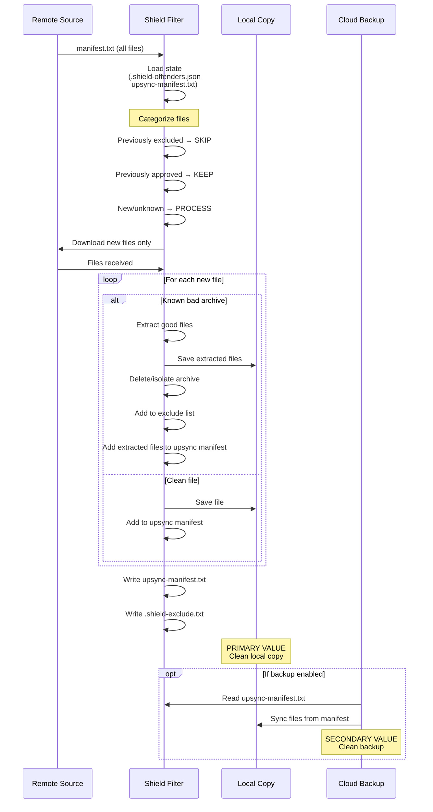

# Shield Architecture: Manifest-Based Remediation Plan

# Shield Architecture: Manifest-Based Remediation Plan

## Executive Summary

The current shield implementation uses a **complex runtime state machine** (pending/cleared files) that is fragile, error-prone, and currently broken (upsync blocks forever). This spec defines a complete architectural refactor to a **manifest-based declarative approach** that is simple, robust, and correct by construction.

## Business Context

### The Problem This App Solves

Users need access to valuable technical files (boardviews, schematics, BIOS files) from sketchy sources that bundle malware with legitimate content.

**Without this app**:
- Manual download of malware-laden archives
- Risk of infection
- Manual extraction of good files
- No backup strategy
- Repeat for every file

**With this app**:
- Automated sync from source
- Malware filtering (optional or mandatory)
- Clean local copy ready to use ← **PRIMARY VALUE**
- Optional cloud backup for redundancy ← **SECONDARY VALUE**

### The Google Drive Incident

**What happened**: User enabled Google Drive backup → Google flagged malware → Account suspended → Had to create new project with new credentials

**Solution**: Shield became **MANDATORY** when Google Drive is selected as backup provider

**Current behavior**:
- Google Drive backup → Shield REQUIRED (enforced)
- Other providers (S3, B2, etc.) → Shield OPTIONAL (user choice)
- No backup → Shield OPTIONAL (user choice)

## Current Architecture (BROKEN)



### Critical Problems

1. **Upsync Blocks Forever**
   - Files marked pending but never cleared
   - Queue marked complete with pending files
   - Cloud phase sees empty queue and exits
   - Files never uploaded

2. **Complex State Management**
   - Two-phase state (pending → cleared)
   - Race conditions between phases
   - Path matching issues
   - ~200 lines of fragile state tracking code

3. **No Single Source of Truth**
   - What should be upsynced? (runtime state)
   - What was excluded? (`.shield-offenders.json`)
   - What's in backup? (unknown)

4. **Hard to Debug**
   - Runtime state invisible
   - No audit trail
   - Can't inspect what will be upsynced

## Target Architecture (MANIFEST-BASED)



### Key Principles

1. **Declarative, Not Imperative**
   - Current: "Mark pending, then clear later" (imperative)
   - Target: "Here's the list of approved files" (declarative)

2. **Single Source of Truth**
   - `upsync-manifest.txt` = definitive list of files to backup
   - No runtime state synchronization needed

3. **Idempotent & Resumable**
   - Can regenerate manifest anytime
   - Easy to verify: diff manifests
   - Resume after failure: regenerate

4. **Shield as Pure Filter**
   - Input: Remote manifest
   - Output: Upsync manifest + Exclude list
   - No complex state machine

## File Structure

### Remote Source (Untrusted)
```
/remote/
├── manifest.txt                                  ← All files in source
├── GV-R580AORUS-8GD-1.0-1.01 Boardview.zip      ← Malware + boardview
├── some-schematic.pdf                            ← Clean file
├── BIOS_K54C-Chinafix.zip                       ← Malware + BIOS
└── clean-board.bvr                              ← Clean file
```

### Local Copy (Clean - Primary Value)
```
/local/
├── manifest.txt                                  ← Copy of remote manifest
├── upsync-manifest.txt                          ← Shield-approved files
├── .shield-exclude.txt                          ← Files to never download
├── .shield-offenders.json                       ← Detailed shield history
├── GV-R580AORUS-8GD-1.0-1.01.bvr               ← Extracted from archive
├── GV-R580AORUS-8GD-1.0-1.01.tvw               ← Extracted from archive
├── some-schematic.pdf                           ← Clean file
├── BIOS_K54C.bin                               ← Extracted from archive
├── clean-board.bvr                             ← Clean file
└── _risk_tools/                                ← Isolated malware (if policy=isolate)
    ├── GV-R580AORUS-8GD-1.0-1.01 Boardview.zip
    └── crack.exe
```

### Cloud Backup (Clean - Secondary Value)
```
/backup/
├── upsync-manifest.txt                          ← For change tracking
├── GV-R580AORUS-8GD-1.0-1.01.bvr               ← From local
├── GV-R580AORUS-8GD-1.0-1.01.tvw               ← From local
├── some-schematic.pdf                           ← From local
├── BIOS_K54C.bin                               ← From local
└── clean-board.bvr                             ← From local
```

**Notice**: Backup has ONLY clean files, NO malicious archives

## Manifest Format

### Remote Manifest (from source)
```
# All files in remote source
GV-R580AORUS-8GD-1.0-1.01 Boardview.zip
some-schematic.pdf
another-board.bvr
BIOS_K54C usb 3.0_factory-Chinafix.zip
clean-file.pdf
```

### Upsync Manifest (shield-generated)
```
# Files approved for backup (clean only)
GV-R580AORUS-8GD-1.0-1.01.bvr
GV-R580AORUS-8GD-1.0-1.01.tvw
some-schematic.pdf
another-board.bvr
BIOS_K54C.bin
clean-file.pdf
```

### Exclude List (shield-generated)
```
# Files to never download again
GV-R580AORUS-8GD-1.0-1.01 Boardview.zip
BIOS_K54C usb 3.0_factory-Chinafix.zip
_risk_tools/**
```

## Shield Processing Flow

### Initial Sync (First Run)

```
1. Download remote manifest (1000 files)
2. Shield categorizes:
   - 0 previously excluded (first run)
   - 0 previously approved (first run)
   - 1000 new files → DOWNLOAD & PROCESS

3. Shield processes:
   - Downloads all 1000 files
   - Identifies 50 as known bad archives
   - Extracts 150 good files from 50 bad archives
   - Deletes/isolates 50 bad archives
   - Keeps 950 clean files

4. Shield outputs:
   - upsync-manifest.txt: 1100 files (950 clean + 150 extracted)
   - .shield-exclude.txt: 50 archives
   - .shield-offenders.json: Detailed history

5. Local copy: 1100 clean files
6. If backup enabled: Sync 1100 files to cloud
```

### Subsequent Sync (One Week Later)

```
1. Download remote manifest (1010 files - 10 new)
2. Shield categorizes:
   - 50 previously excluded → SKIP (not downloaded)
   - 950 previously approved → SKIP (already have)
   - 10 new files → DOWNLOAD & PROCESS

3. Shield processes:
   - Downloads only 10 new files
   - 2 are bad archives → extract, exclude
   - 8 are clean → approve

4. Shield outputs:
   - upsync-manifest.txt: 1112 files (1100 + 8 clean + 4 extracted)
   - .shield-exclude.txt: 52 archives
   - .shield-offenders.json: Updated history

5. Local copy: +12 new files
6. If backup enabled: Sync only 12 new files (incremental)
```

## Shield Modes

### Mode 1: Shield Disabled (Local-only or non-Google backup)

```
Flow:
1. Download all files from remote manifest
2. Save to local copy (including bad archives)
3. If backup enabled: Sync all files to cloud

Result:
- Local has everything (including malware)
- Backup has everything (including malware)
- User's choice, user's risk
```

### Mode 2: Shield Enabled (User choice or Google Drive)

```
Flow:
1. Download remote manifest
2. Shield filters and processes
3. Generate upsync-manifest.txt
4. Save clean files to local
5. If backup enabled: Sync only approved files

Result:
- Local has clean files + _risk_tools/ (isolated)
- Backup has ONLY clean files
- Google-safe, no account suspension risk
```

### Mode 3: Standalone Shield (Enable shield later)

```
Flow:
1. User has existing local copy (may have malware)
2. User enables shield in options
3. Shield scans existing local files
4. Processes archives, extracts good files
5. Generates upsync-manifest.txt retroactively
6. Updates exclude list

Result:
- Local copy cleaned
- Upsync manifest generated
- Ready for Google Drive backup
```

## Google Drive Enforcement

### Validation Logic

```typescript
// In wizard or options
if (config.backup_provider === "gdrive" && !config.enable_malware_shield) {
    throw new Error("Shield is REQUIRED for Google Drive backups");
}

// Enforce in config save
function validateConfig(config: PortalConfig): void {
    if (config.backup_provider === "gdrive") {
        config.enable_malware_shield = true;  // Force enable
        config.malware_policy = "isolate";    // Recommended for forensics
    }
}
```

### UI Indication

When Google Drive is selected:
- Shield toggle: DISABLED (grayed out, always ON)
- Tooltip: "Shield is required for Google Drive to prevent account suspension"
- Policy choice: Still available (purge vs isolate)

## Change Tracking

### Comparing Local vs Backup

```bash
# What's new locally (not yet backed up)
comm -23 local/upsync-manifest.txt backup/upsync-manifest.txt

# What's in backup but not local (deleted locally)
comm -13 local/upsync-manifest.txt backup/upsync-manifest.txt

# What's different (for sync planning)
diff local/upsync-manifest.txt backup/upsync-manifest.txt
```

### Manifest Versioning

```
# upsync-manifest.txt header
# Generated: 2026-02-05T10:30:00Z
# Total files: 1112
# Shield version: 2.0.0
# Policy: isolate

file1.bvr
file2.tvw
...
```

## Migration Strategy

### Phase 1: Add Manifest Generation (Non-Breaking)

- Shield generates `upsync-manifest.txt` alongside current logic
- Keep existing pending/cleared system running
- Validate manifest matches actual upsynced files
- No user-facing changes

### Phase 2: Switch Upsync to Manifest (Breaking)

- Upsync reads from `upsync-manifest.txt`
- Remove `StreamingFileQueue` pending/cleared logic
- Simplify pull phase (no markPending/clearPending)
- Test thoroughly

### Phase 3: Cleanup (Simplification)

- Delete ~200 lines of state management code
- Remove `StreamingFileQueue` class
- Simplify sync orchestration
- Update tests

### Phase 4: Add Standalone Shield Mode

- UI option to run shield on existing local copy
- Scan and process existing files
- Generate manifest retroactively
- Enable Google Drive backup for existing users

## Benefits

### Correctness
- ✅ No race conditions (declarative)
- ✅ No path matching issues (manifest is authoritative)
- ✅ No stuck files (manifest is complete or not)
- ✅ Idempotent (can regenerate anytime)

### Simplicity
- ✅ ~200 lines of code deleted
- ✅ No complex state machine
- ✅ Easy to understand and maintain
- ✅ Easy to test

### Debuggability
- ✅ Inspect `upsync-manifest.txt` anytime
- ✅ Clear audit trail
- ✅ Easy to verify correctness
- ✅ Can manually edit if needed

### Performance
- ✅ Known bad archives never downloaded twice
- ✅ Incremental processing (only new files)
- ✅ Efficient bandwidth usage
- ✅ Fast subsequent syncs

### User Experience
- ✅ Google Drive backups work reliably
- ✅ No account suspension risk
- ✅ Clean local copy (primary value)
- ✅ Optional clean backup (secondary value)

## Success Criteria

### Functional
- [ ] Upsync never blocks (files always released)
- [ ] Google Drive backups never contain malware
- [ ] Local copy is clean when shield enabled
- [ ] Incremental syncs only process new files
- [ ] Standalone shield mode works on existing copies

### Technical
- [ ] `upsync-manifest.txt` is single source of truth
- [ ] No pending/cleared state management
- [ ] ~200 lines of code deleted
- [ ] All tests passing
- [ ] No regressions

### User-Facing
- [ ] Shield required for Google Drive (enforced)
- [ ] Shield optional for other providers
- [ ] Can enable shield later (standalone mode)
- [ ] Clear UI indication of shield status
- [ ] No account suspensions

## Related Files

### Core Implementation
- `file:src/lib/shield/ShieldManager.ts` - Shield state management
- `file:src/lib/shield/ShieldExecutor.ts` - Shield processing logic
- `file:src/lib/shield/patterns.ts` - Malware patterns

### Sync Flow
- `file:src/lib/sync/pullPhase.ts` - Download and shield integration
- `file:src/lib/sync/cloudPhase.ts` - Upsync to backup
- `file:src/lib/sync/streamingQueue.ts` - **TO BE DELETED**
- `file:src/lib/sync/index.ts` - Sync orchestration

### Configuration
- `file:src/lib/config.ts` - Portal configuration
- `file:src/lib/env.ts` - Environment paths

### UI
- `file:src/components/panels/LocalShieldPanel.tsx` - Shield status display
- `file:src/components/Wizard.tsx` - Setup wizard
- `file:src/components/Options.tsx` - Settings panel

## Implementation Priority

1. **CRITICAL**: Implement manifest generation (non-breaking)
2. **CRITICAL**: Switch upsync to use manifest
3. **HIGH**: Remove pending/cleared code
4. **HIGH**: Enforce shield for Google Drive
5. **MEDIUM**: Add standalone shield mode
6. **MEDIUM**: Add manifest-based change tracking
7. **LOW**: UI improvements for shield status

## Risk Assessment

| Risk | Severity | Mitigation |
|------|----------|------------|
| Breaking existing syncs | HIGH | Phased migration, thorough testing |
| Data loss during migration | MEDIUM | Backup before migration, validate manifests |
| Performance regression | LOW | Manifest processing is faster than runtime state |
| User confusion | LOW | Clear UI messaging, documentation |

## Conclusion

The manifest-based architecture is **objectively superior** to the current pending/cleared approach. It's simpler, more robust, easier to debug, and correct by construction. The migration is straightforward and can be done in phases to minimize risk.

This refactor will:
- Fix the current upsync blocking bug permanently
- Simplify the codebase significantly (~200 lines deleted)
- Make Google Drive backups reliable and safe
- Improve performance (incremental processing)
- Enable new features (standalone shield mode, change tracking)

**This is the right architecture for the long term.**