# Schematic Sync Portal - Comprehensive Application Audit

**Audit Date:** 2026-02-04  
**Auditor:** Antigravity AI  
**Scope:** End-to-end codebase audit covering architecture, code quality, UI patterns, test coverage, and security

---

## Executive Summary

The Schematic Sync Portal is a well-structured TUI application for managing multi-cloud schematic synchronization. The codebase demonstrates strong architectural patterns but has accumulated technical debt, particularly around type safety and component complexity. This audit identifies **12 improvement areas** across 4 priority levels.

### Quick Stats
| Metric | Value |
|--------|-------|
| Total Lines of Code | ~15,000 |
| Components | 15 |
| Library Modules | 18 |
| Test Files | 18 |
| Test Results | **124 pass**, 6 todo, 0 fail |
| Lint Status | ✅ Clean |
| ESLint Disable Comments | 21 |

---

## Architecture Overview

```mermaid
graph TB
    subgraph "Entry Point"
        IDX[index.tsx<br/>1011 lines]
    end
    
    subgraph "Views"
        SPLASH[Splash]
        WIZARD[Wizard.tsx<br/>⚠️ 2231 lines]
        DASH[Dashboard]
        SYNC[SyncPortal]
        OPTS[Options]
        DOC[Doctor]
        FVIEW[ForensicView]
    end
    
    subgraph "UI Components"
        HK[Hotkey]
        FI[FontInstaller]
        PI[ProviderIcon]
        SPP[SyncPortalParts]
    end
    
    subgraph "Core Libraries"
        SYNCLIB[sync.ts<br/>782 lines]
        CFG[config.ts]
        RCLONE[rclone.ts]
        CLEAN[cleanup.ts]
        AUTH[auth.ts]
        ENV[env.ts]
        LOG[logger.ts]
        DEPLOY[deploy.ts]
    end
    
    subgraph "Support Libraries"
        UPD[updater.ts]
        STATE[syncState.ts]
        FGUARD[fontGuard.ts]
        FINST[fontInstaller.ts]
        FCACHE[fontCache.ts]
        CLIP[clipboard.ts]
        FOREN[forensics.ts]
        THEME[theme.tsx]
    end
    
    subgraph "External"
        RCLONECLI[rclone CLI]
        FS[File System]
        CLOUD[Cloud Providers]
    end
    
    IDX --> SPLASH
    IDX --> WIZARD
    IDX --> DASH
    IDX --> SYNC
    IDX --> OPTS
    IDX --> DOC
    IDX --> FVIEW
    
    SYNC --> SPP
    WIZARD --> PI
    
    SYNCLIB --> RCLONE
    SYNCLIB --> CLEAN
    CLEAN --> RCLONE
    RCLONE --> RCLONECLI
    RCLONECLI --> CLOUD
    
    CFG --> FS
    LOG --> FS
    STATE --> FS
```



### Three-Phase Sync Engine


---

## Findings by Category

### 🔴 Priority 1: Critical (Architectural Issues)

#### 1. Wizard.tsx Complexity
**File:** [Wizard.tsx](file:///home/birdman/schem-sync-portal/src/components/Wizard.tsx)  
**Lines:** 2231  
**Issue:** Violates the 500-line component rule by 4.5x

**Impact:**
- Difficult to maintain and debug
- High cognitive load for developers
- Risk of regression bugs
- Hard to test individual flows

**Current Structure:**


**Recommendation:** Split into modular components:
```
src/components/wizard/
├── WizardContainer.tsx     # Main orchestrator
├── SourceChoice.tsx        # Provider selection
├── CopypartyConfig.tsx     # Copyparty-specific
├── DirectoryConfig.tsx     # Local dir setup
├── CloudProviderBase.tsx   # Shared cloud logic
├── providers/
│   ├── GDriveSetup.tsx
│   ├── B2Setup.tsx
│   ├── SFTPSetup.tsx
│   ├── MegaSetup.tsx
│   ├── PCloudSetup.tsx
│   ├── R2Setup.tsx
│   ├── OneDriveSetup.tsx
│   └── DropboxSetup.tsx
└── WizardFooter.tsx        # Shared footer
```

---

### 🟠 Priority 2: High (Code Quality)

#### 2. Type Safety Debt (21 `any` usages)
**Files Affected:**
- [fontInstaller.ts](file:///home/birdman/schem-sync-portal/src/lib/fontInstaller.ts) - 10 instances
- [FontInstaller.tsx](file:///home/birdman/schem-sync-portal/src/components/FontInstaller.tsx) - 2 instances
- [fontInstaller.test.ts](file:///home/birdman/schem-sync-portal/src/tests/fontInstaller.test.ts) - 7 instances
- [fontCache.test.ts](file:///home/birdman/schem-sync-portal/src/tests/fontCache.test.ts) - 2 instances

**Pattern:** AbortController signal typing issues
```typescript
// Current (unsafe)
const controller = new AbortController() as any;
(signal as any)?.aborted

// Recommended
const controller = new AbortController();
if (signal?.aborted) // Modern TypeScript handles this
```

**Impact:** Bypass of TypeScript's type checking, potential runtime errors

#### 3. Incomplete Test Coverage for Panel Focus
**File:** [SyncPortalParts.test.tsx](file:///home/birdman/schem-sync-portal/src/tests/SyncPortalParts.test.tsx)  
**Status:** 6 tests marked as `todo`

| Test | Status |
|------|--------|
| DownsyncPanel - preserve sub-focus on hover | todo |
| DownsyncPanel - reset sub-focus on click | todo |
| LocalShieldPanel - preserve sub-focus on hover | todo |
| LocalShieldPanel - reset sub-focus on click | todo |
| UpsyncPanel - preserve sub-focus on hover | todo |
| UpsyncPanel - reset sub-focus on click | todo |

**Impact:** UI interaction regressions may go undetected

---

### 🟡 Priority 3: Medium (Maintainability)

#### 4. Empty Catch Blocks
**Count:** 15+ instances across codebase

**Examples:**
```typescript
// logger.ts:83
try { if (existsSync(oldPath)) unlinkSync(oldPath); } catch { }

// env.ts:97
} catch { }

// sync.ts:358
} catch { }
```

**Issue:** Silently swallowing errors makes debugging difficult

**Recommendation:** At minimum, log at debug level:
```typescript
try {
    // operation
} catch (err) {
    Logger.debug("CONTEXT", "Optional operation failed", err);
}
```

#### 5. index.tsx Size
**File:** [index.tsx](file:///home/birdman/schem-sync-portal/src/index.tsx)  
**Lines:** 1011  
**Issue:** Entry point handles too much logic

**Recommendation:** Extract into:
- `App.tsx` - Main application component
- `AppContent.tsx` - Content orchestration
- `hooks/useAppState.ts` - State management

#### 6. sync.ts Complexity
**File:** [sync.ts](file:///home/birdman/schem-sync-portal/src/lib/sync.ts)  
**Lines:** 782  
**Functions:** 34

**Recommendation:** Consider splitting into:
- `sync/pullPhase.ts`
- `sync/cleanPhase.ts`
- `sync/cloudPhase.ts`
- `sync/progress.ts`
- `sync/utils.ts`

---

### 🟢 Priority 4: Low (Minor Improvements)

#### 7. Hardcoded Cloud Provider Strings
Multiple files contain hardcoded provider names:
```typescript
// wizard.tsx
if (provider === "gdrive") nextStep = "gdrive_intro";
else if (provider === "b2") nextStep = "b2_intro";
// ... repeated pattern
```

**Recommendation:** Create provider registry:
```typescript
const PROVIDERS = {
    gdrive: { intro: "gdrive_intro", icon: "󰊭", label: "Google Drive" },
    b2: { intro: "b2_intro", icon: "󱌃", label: "Backblaze B2" },
    // ...
} as const;
```

#### 8. Missing Version Management
No version number defined in `package.json` or displayed to users.

**Recommendation:**
- Add `version` field to package.json
- Display version in Options/About view
- Use version in update checks

#### 9. Logger Console Output
```typescript
// logger.ts:162-166
if (level === "NORMAL") {
    console.log(formatted.trim());  // Outputs to console
}
```

**Issue:** TUI apps should not output to console during normal operation as it can interfere with rendering.

**Recommendation:** Make console output optional/debug-only

---

## Security Assessment

### ✅ Strengths

1. **Credential Isolation:** Memory-only credential refs in Wizard
   ```typescript
   // Wizard.tsx:162-179
   const urlRef = useRef("");
   const userRef = useRef("");  // Never saved to config.json
   const passRef = useRef("");
   ```

2. **Sensitive Data Masking:** Logger masks credentials
   ```typescript
   // logger.ts:17-27
   private static sensitivePatterns: RegExp[] = [
       /password/gi, /secret/gi, /cookie/gi, /token/gi, ...
   ];
   ```

3. **Safe Directory Checks:** Protection against dangerous paths
   ```typescript
   // env.ts:104-116
   static isSafeDirectory(path: string): boolean {
       const criticals = ["/usr", "/bin", "/sbin", "/etc", "/var", ...];
       if (criticals.some(c => normalized.startsWith(c))) return false;
       return true;
   }
   ```

4. **Rclone Isolation:** Config managed separately from system rclone

### ⚠️ Areas for Review

1. **Updater Uses execSync:** Shell injection potential if repo URL is compromised
   ```typescript
   // updater.ts:39-41
   execSync("git stash");
   execSync("git fetch origin");
   execSync("git pull --rebase origin main");
   ```

2. **OAuth Token Handling:** Tokens passed through multiple layers

---

## Test Coverage Analysis

### Current Coverage

| Area | Files | Tests | Status |
|------|-------|-------|--------|
| UI Patterns | 1 | 19 | ✅ All pass |
| Hotkey | 1 | 15+ | ✅ All pass |
| SyncPortalParts | 1 | 18 | 12 pass, 6 todo |
| Dashboard | 1 | 12+ | ✅ All pass |
| Auth | 1 | 5+ | ✅ All pass |
| Cleanup | 1 | 8+ | ✅ All pass |
| Deploy | 1 | 5+ | ✅ All pass |
| Doctor | 1 | 10+ | ✅ All pass |
| Font System | 3 | 15+ | ✅ All pass |
| Logger | 1 | 5+ | ✅ All pass |
| Sync | 2 | 10+ | ✅ All pass |
| Updater | 1 | 3+ | ✅ All pass |

### Missing Test Coverage

1. **Wizard.tsx** - No unit tests for the 2231-line component
2. **ForensicView.tsx** - No tests
3. **Options.tsx** - No tests
4. **End-to-end flows** - No integration tests

---

## Previous Audit Status

### 2026-01-31 UI Pattern Audit Fixes

| Finding | Status |
|---------|--------|
| Panel focus preservation on hover | ⚠️ Tests todo |
| Inconsistent border colors | ✅ Fixed |
| Redundant focus handlers | ✅ Fixed |
| Dashboard as reference standard | ✅ Documented |

---

## Recommendations Summary

### Immediate Actions (Week 1)

1. **Complete todo tests** for panel focus preservation
2. **Add basic Wizard tests** for critical flows
3. **Fix empty catch blocks** with debug logging

### Short-term (Month 1)

4. **Split Wizard.tsx** into modular components (~8 files)
5. **Eliminate `any` types** in fontInstaller
6. **Add version management**

### Medium-term (Quarter 1)

7. **Split index.tsx** into App/AppContent/hooks
8. **Modularize sync.ts** into phase-specific files
9. **Add E2E testing framework**
10. **Create provider registry** for cloud providers

### Long-term (Continuous)

11. **Maintain component size limits** (<500 lines)
12. **Enforce type safety** in CI (no new `any`)

---

## Architecture Diagrams

### Component Hierarchy


### Data Flow


---

## Conclusion

The Schematic Sync Portal demonstrates solid architectural fundamentals with a clear three-phase sync engine and well-organized library modules. The primary technical debt centers on the oversized `Wizard.tsx` component and scattered type safety bypasses.

**Recommended Priority:**
1. Focus preservation tests (unblock previous audit fixes)
2. Wizard component split (biggest maintainability win)
3. Type safety cleanup (eliminate all `any` usages)

The codebase is production-ready but would benefit significantly from the proposed refactoring to ensure long-term maintainability.

---

*Generated by Antigravity AI Audit System*
