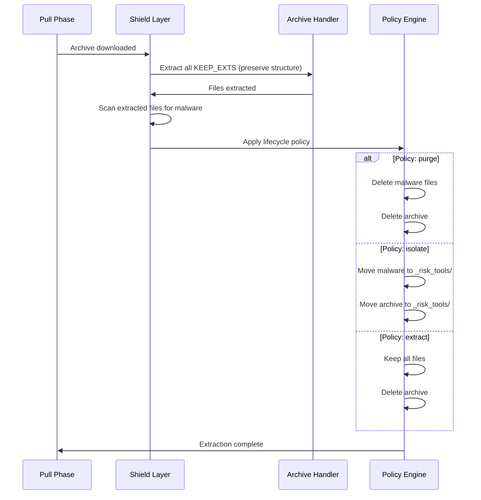

# Always-On Archive & Security Layer Architecture

## Overview

This specification defines the architectural transformation of the Malware Shield into an **Always-On Archive & Security Layer** that handles all compressed archives (`.zip`, `.7z`, `.rar`) regardless of security policy settings. The current implementation only extracts archives when malware patterns are detected, leaving clean archives compressed and requiring manual extraction.

## Current Architecture Problems

### 1. Clean Archive Bypass (Critical)
**Location**: `file:src/lib/cleanup.ts` (Lines 221-327)

The extraction logic is encapsulated **inside** the `if (hasGarbage)` block. When an archive contains no malware patterns:
- The function returns early with `{ flagged: false, extractedCount: 0 }`
- No extraction occurs
- Users must manually unzip clean archives

```typescript
// Current problematic flow
if (hasGarbage) {
  // Extract KEEP_EXTS files
  // Scan for nested archives
  // Apply policy (purge/isolate)
}
return { flagged: false, extractedCount: 0 }; // Clean archives skip extraction
```

### 2. Folder Flattening (Critical)
**Location**: `file:src/lib/cleanup.ts` (Line 248)

```typescript
const destPath = join(dirPath, basename(match));
```

Using `basename(match)` strips all directory structure:
- `SubFolder/schematic.pdf` → `schematic.pdf`
- Multiple files with same name overwrite each other
- Original hierarchy is lost

### 3. Path Filtering Bypass (High)
**Location**: `file:src/lib/sync/pullPhase.ts` (Line 161)

```typescript
const filename = f.split('/').pop() || f;
const keep = shouldDownloadInLeanMode(filename);
```

Only checks filename, not full path:
- `Computers/BIOS/archive.zip` checks only `archive.zip`
- BIOS folders are downloaded despite exclusion intent
- Path-based filtering is ineffective

### 4. Shield Dependency (High)
**Location**: `file:src/lib/sync/pullPhase.ts` (Lines 216, 349)

Extraction only occurs when `config.enable_malware_shield === true`:
- Full mode with shield disabled: archives downloaded but never extracted
- No extraction path exists outside the shield system

## Proposed Architecture

### Core Principles

1. **Always Extract**: All archives are extracted regardless of malware detection
2. **Policy-Driven Lifecycle**: User chooses what happens to archives and malware after extraction
3. **Structure Preservation**: Maintain original folder hierarchies during extraction
4. **Path-Aware Filtering**: Filter based on full paths, not just filenames

### New Policy System

Replace the binary `enable_malware_shield` toggle with a universal **Archive Policy** setting:

| Policy | Behavior | Use Case |
|--------|----------|----------|
| `purge` | Extract good files → Delete archive + malware | Default/Lean mode (save space) |
| `isolate` | Extract good files → Move archive to `_risk_tools/` | Forensic analysis |
| `extract` | Extract all files → Delete archive | Trust source completely |

### Architecture Flow



### Implementation Strategy

#### Phase 1: Decouple Extraction from Detection

**File**: `file:src/lib/cleanup.ts`

Transform `cleanArchive()` to always extract, regardless of `hasGarbage`:

```typescript
async function cleanArchive(...) {
  // 1. ALWAYS extract KEEP_EXTS with structure preservation
  const extractedFiles = await extractArchiveContents(archivePath, baseDir);
  
  // 2. Scan extracted files for malware
  const malwareFiles = await scanExtractedFiles(extractedFiles);
  
  // 3. Apply policy
  await applyArchivePolicy(archivePath, malwareFiles, policy);
  
  return { flagged: malwareFiles.length > 0, extractedCount: extractedFiles.length };
}
```

#### Phase 2: Preserve Directory Structure

**File**: `file:src/lib/cleanup.ts` (Line 248)

Replace `basename()` with relative path reconstruction:

```typescript
// Current (flattens):
const destPath = join(dirPath, basename(match));

// Proposed (preserves):
const relativePathInArchive = relative(stagingDir, match);
const destPath = join(dirPath, relativePathInArchive);
```

Ensure parent directories are created:
```typescript
const destDir = dirname(destPath);
if (!existsSync(destDir)) {
  mkdirSync(destDir, { recursive: true });
}
```

#### Phase 3: Path-Aware Filtering

**File**: `file:src/lib/sync/pullPhase.ts` (Line 161)

Check both filename AND full path:

```typescript
// Current (filename only):
const filename = f.split('/').pop() || f;
const keep = shouldDownloadInLeanMode(filename);

// Proposed (path-aware):
const keep = shouldDownloadInLeanMode(f); // Pass full path

// Update shouldDownloadInLeanMode in archiveAnalyzer.ts:
export function shouldDownloadInLeanMode(filePath: string): boolean {
  const lowerPath = filePath.toLowerCase();
  const filename = filePath.split('/').pop() || filePath;
  
  // Check FULL PATH for exclusions (catches BIOS folders)
  if (LEAN_MODE_EXCLUDE_PATTERNS.some(p => lowerPath.includes(p.toLowerCase()))) {
    return false;
  }
  
  // Check filename for valuable indicators
  if (VALUABLE_ARCHIVE_INDICATORS.some(ind => filename.toLowerCase().includes(ind.toLowerCase()))) {
    return true;
  }
  
  return true; // Default: keep ambiguous files
}
```

#### Phase 4: Add "Extract" Policy

**File**: `file:src/lib/config.ts`

Update policy type:
```typescript
malware_policy: "purge" | "isolate" | "extract";
```

**File**: `file:src/lib/cleanup.ts`

Handle new policy in archive lifecycle:
```typescript
if (policy === "extract") {
  // Keep all extracted files (including malware)
  // Only delete the original archive
  unlinkSync(archivePath);
  stats.purgedFiles++;
} else if (policy === "isolate") {
  // Existing isolate logic
} else {
  // Existing purge logic
}
```

### Configuration Migration

**File**: `file:src/lib/config.ts`

Migrate existing configs:
```typescript
// Old: enable_malware_shield (boolean)
// New: archive_policy ("purge" | "isolate" | "extract")

if (parsed.enable_malware_shield === false) {
  parsed.archive_policy = "extract"; // No shield = extract all
} else if (parsed.malware_policy === "isolate") {
  parsed.archive_policy = "isolate";
} else {
  parsed.archive_policy = "purge"; // Default
}
```

### UI Changes

The Security Step in the wizard should present three clear options:

1. **Purge (Recommended)**: Extract schematics, delete archives and malware
2. **Isolate (Forensic)**: Extract schematics, quarantine archives with malware
3. **Extract All (Trust Source)**: Extract everything, delete archives only

### Testing Requirements

1. **Structure Preservation Test**: Verify nested folders are maintained
2. **Clean Archive Test**: Verify clean archives are extracted
3. **Path Filtering Test**: Verify BIOS folders are excluded in lean mode
4. **Policy Test**: Verify all three policies behave correctly
5. **Nested Archive Test**: Verify recursive extraction preserves structure

## Benefits

| Benefit | Impact |
|---------|--------|
| **No Manual Extraction** | Users never need to manually unzip files |
| **Structure Preservation** | Original folder hierarchies maintained |
| **Accurate Filtering** | Path-based exclusions work correctly |
| **Policy Flexibility** | Users choose archive lifecycle behavior |
| **Simplified Logic** | Extraction decoupled from security scanning |

## Migration Path

1. Deploy with default `archive_policy: "purge"` (maintains current behavior for malware)
2. Existing users with `enable_malware_shield: false` auto-migrate to `archive_policy: "extract"`
3. UI updated to show three policy options instead of shield toggle
4. Documentation updated to explain new policy system

## Related Files

- `file:src/lib/cleanup.ts` - Core extraction and policy logic
- `file:src/lib/sync/pullPhase.ts` - Path filtering and sweep orchestration
- `file:src/lib/shield/archiveAnalyzer.ts` - Lean mode filtering logic
- `file:src/lib/shield/ShieldExecutor.ts` - Sweep execution
- `file:src/lib/config.ts` - Configuration schema
- `file:src/components/wizard/steps/SecurityStep.tsx` - UI for policy selection